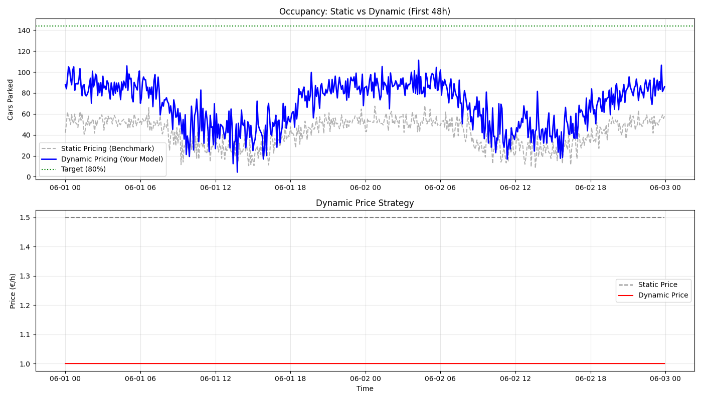
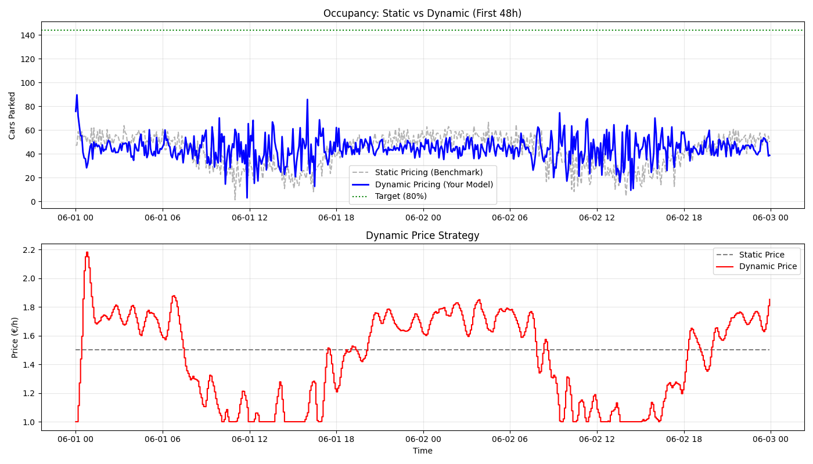

## 0.80 VS 0.25 Target de occupancy

0.80:

0.25:

A análise da simulação inicial mostrou que o preço dinâmico permaneceu constante no limite inferior ($p_{min} = 1.0€$). Isto não representa uma falha do modelo, mas sim o funcionamento correto do controlador de feedback: dado que a ocupação observada (~38%) foi consistentemente inferior ao target definido (80%), o algoritmo aplicou a estratégia ótima de minimização de preço para estimular a procura. Testes de sensibilidade ajustando o target para 25% confirmaram a capacidade do sistema de aumentar preços em cenários de excesso de procura.